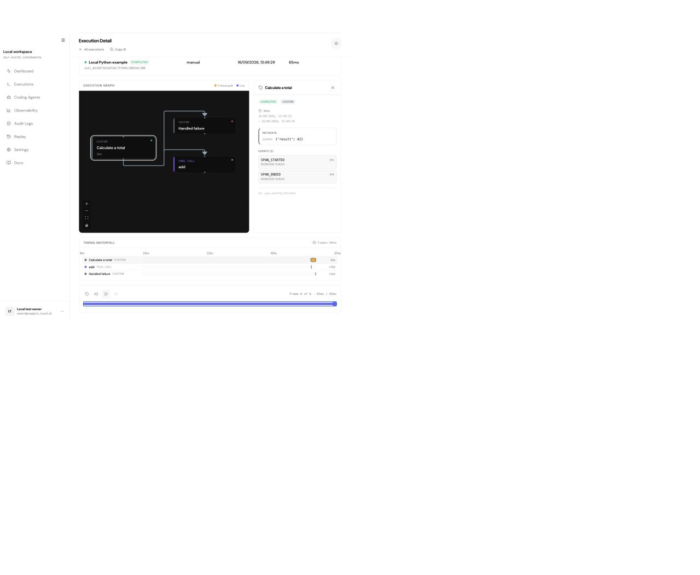

# Fact0

Self-hosted execution inspection and audit records for AI agents, with Python and Claude Code integrations.

Fact0 records executions, tool calls, supported model content and a separate hash-chained audit log. Inspect timelines and DAGs, replay recorded history, verify audit chains and download signed exports.

**Experimental, MIT licensed, best-effort maintenance.** This release supports one owner and one workspace. It does not provide a hosted service, compliance certification, complete agent capture guarantees or an SLA. Replay reconstructs recorded activity; it does not rerun the agent.



The screenshot uses synthetic data from the included example. See [release scope and limitations](RELEASE.md).

## Quickstart

Requirements: Docker Engine with Compose v2 (or Docker Desktop), Python 3 and OpenSSL 1.1.1 or newer. Linux and macOS are the supported setup environments. The initial build downloads dependencies; the running core needs no cloud account.

```sh
git clone https://github.com/fact0-ai/fact0.git
cd fact0
python3 scripts/init-env.py
docker compose up --build -d --wait
docker compose exec web node scripts/owner.mjs create
```

The owner command prompts for credentials locally. Open [http://localhost:3000](http://localhost:3000), sign in, and create an API key in Settings → API keys. API ingestion is available at [http://localhost:8000](http://localhost:8000). Both exposed ports bind to localhost; PostgreSQL has no published port.

If a default port is occupied, generate the configuration with `python3 scripts/init-env.py --origin http://localhost:3001 --api-port 8001` before starting. Use those ports in your browser and integration settings. The command preserves an existing `.env`; edit its port and origin values directly to change an existing installation.

The generated `.env` holds instance credentials and export signing material with owner-only permissions. Setup preserves an existing file. Back it up securely with your database. No OAuth, email, AWS, Neon or Redis setup is required.

### Python

Use the SDK from this checkout so it matches the candidate core:

```sh
python3 -m venv .venv
. .venv/bin/activate
pip install -e ./sdk/python
export FACT0_BASE_URL=http://localhost:8000
# Set FACT0_API_KEY to your local key without committing it to a file.
python examples/local-python.py
```

The example needs no model account. It creates a nested execution with one successful tool and one handled failure, reads the results back, verifies the audit chain, and saves an evidence ZIP. Open Executions to inspect it.

### Claude Code

Follow the [Claude Code guide](docs/integrations/claude-code.mdx) to prepare the collector **before** the first session, install the plugin, and set your local API destination/key. Capture and inspection are supported; policy enforcement is disabled.

The self-hosted profile defaults to full content from supported hooks and supported transcript text. Prompts, source code, tool input/output and errors may be stored in your authenticated installation and local retry spool. Select `FACT0_CC_CAPTURE_MODE=hash` or `metadata` for reduced capture. Missing or unsupported content is reported as incomplete; capture is not guaranteed to include every Claude interaction.

## Operation

```sh
docker compose logs --tail=100
docker compose down                         # retain the database volume
bash scripts/backup.sh                      # private backups/ directory
docker compose exec web node scripts/owner.mjs reset-password
python3 scripts/export-public-key.py         # public key only; retain separately
```

Records do not expire automatically. Monitor disk usage and back up the persistent volume/database and `.env`. See [operation and restore](docs/guides/self-hosting.mdx), [security](docs/guides/security.mdx), and [verification](docs/guides/verification.mdx). Use a reverse proxy with TLS and an explicit public origin if you expose the owner installation remotely.

Fresh installation is the supported starting point. The migration command records schema versions and refuses unknown existing databases. There is no migration from the former hosted service in this release. Do not point setup at an existing production database.

## Included

- Go API, Next.js dashboard and PostgreSQL deployment.
- Authenticated execution inspection, DAG/timeline/replay and basic usage estimates.
- Audit search, hash-chain verification and signed PDF/evidence exports.
- Python, TypeScript and Go SDK source with existing package identities.
- Claude Code collector, plugin and session inspection.

Billing, invitations, founder administration, Spotlight, email services, alert webhooks, public sharing, governance enforcement and OTLP are unavailable in the supported core. Pricing data is bundled and costs are estimates when usage data is available.

## Source and development

| Directory | Contents |
| --- | --- |
| `api/` | Go API, database schema and tracked migration command |
| `web/` | Dashboard, landing pages and owner provisioning |
| `sdk/` | Python, TypeScript and Go clients |
| `claude-code-plugin/` | Claude Code hooks and collector |
| `docs/` | Mintlify documentation sources |
| `openapi/` | Canonical audit and telemetry REST specifications |

See [CONTRIBUTING.md](CONTRIBUTING.md). Run `make docs-sync` after changing OpenAPI. SDK defaults retain their published behavior; always supply your self-hosted API URL explicitly.

[MIT license](LICENSE). Third-party notices are in [THIRD_PARTY_NOTICES.md](THIRD_PARTY_NOTICES.md).
