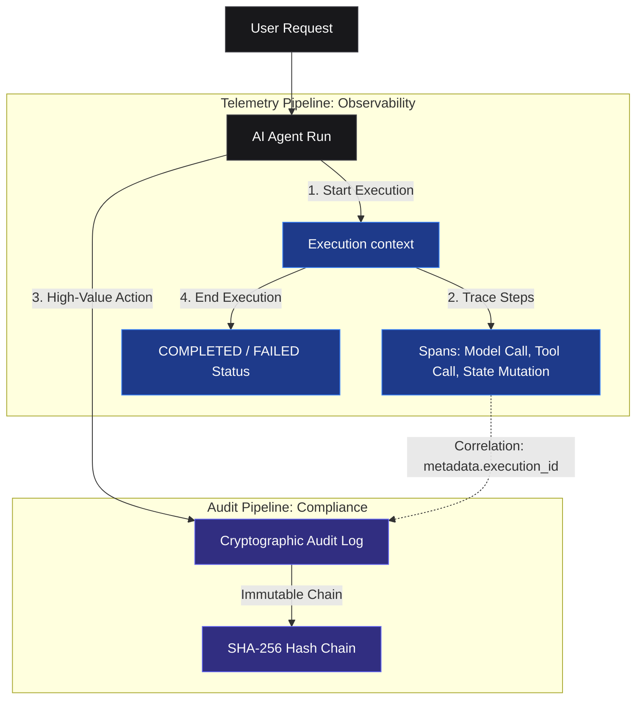

# Audit vs telemetry

Fact0 has **two parallel pipelines**:

```
Audit log   →  "Did it happen? Who? When?"     (compliance)
Telemetry   →  "How did it happen? Why?"       (debugging)
```

For high-value events (LLM spend, customer data access, refunds) log to **both**.



## Comparison Matrix

| Dimension | Audit Log | Execution Telemetry |
| :--- | :--- | :--- |
| **Purpose** | Compliance, Security Proof, GRC Audits | Debugging, Traceability, Replay, Performance |
| **Immutability** | Cryptographically chained (SHA-256) | Append-only tracing (no hash chain) |
| **Ingest API** | `/v1/events` (Sync or Async) | `/api/v1/executions` (Async spans) |
| **Target Audience** | Enterprise CISOs, Security Teams | AI Developers, System Operators |
| **Key Metrics** | Access violations, spending bounds, approvals | Latency, token counts, model outputs, tool execution |

## Correlation Best Practice

When executing complex multi-agent steps, always include the telemetry `execution_id` inside the audit event's `metadata` dictionary. This enables auditors to verify that a specific action occurred (via the audit chain) and developers to inspect *how* it happened (via the execution DAG).

## Audit log

- **Endpoints:** `/v1/events`, `/v1/events/batch`
- **Storage:** `audit_events` - SHA-256 hash chain per tenant
- **Auth:** `f0_live_*` API keys (read/write scopes)
- **Use for:** security evidence, tamper detection, regulator exports

## Execution telemetry

- **Endpoints:** `/api/v1/executions/*`
- **Storage:** `executions`, `spans`, `execution_events`
- **Auth:** `f0_live_*` API keys (same as audit log on Fact0 Cloud)
- **Use for:** DAG visualization, replay, debugging non-deterministic agents

## Span kinds (telemetry)

| `span_type` | Example |
|-------------|---------|
| `TOOL_CALL` | `web_search`, `db.query` |
| `MODEL_INVOCATION` | `gpt-4o`, `claude-sonnet` |
| `STATE_MUTATION` | cache/DB read-write |
| `HUMAN_APPROVAL` | manager sign-off |
| `POLICY_EVALUATION` | guardrail / OPA check |
| `CUSTOM` | routing, planning |

## Audit event shape

```json
{
  "actor": { "id": "...", "type": "human|agent|system" },
  "action": "resource.verb",
  "resource": { "id": "...", "type": "..." },
  "outcome": "success|failure|error",
  "metadata": {}
}
```

See [Event schema](/concepts/events) and [Executions](/concepts/executions).
