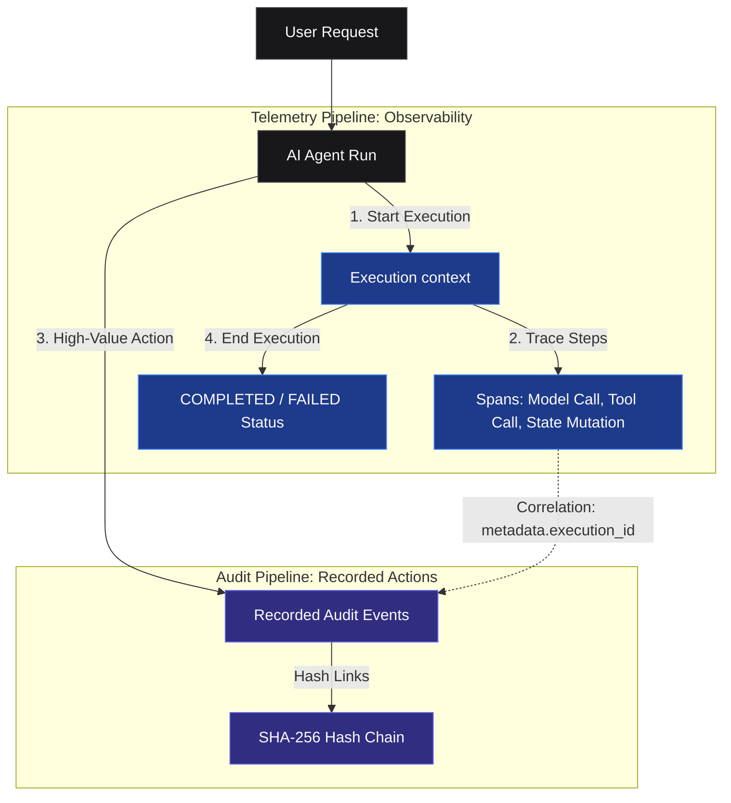

# Audit vs telemetry

Fact0 has **two parallel pipelines**:

```
Audit log   →  "Did it happen? Who? When?"     (recorded actions)
Telemetry   →  "How did it happen? Why?"       (debugging)
```

For high-value events (LLM spend, customer data access, refunds) log to **both**.


```mermaid
graph TD
    Request[User Request] --> Agent[AI Agent Run]
    
    subgraph Telemetry Pipeline [Telemetry Pipeline: Observability]
        Agent -->|1. Start Execution| Exec[Execution context]
        Exec -->|2. Trace Steps| Spans[Spans: Model Call, Tool Call, State Mutation]
        Exec -->|4. End Execution| ExecEnd[COMPLETED / FAILED Status]
    end
    
    subgraph Audit Pipeline [Audit Pipeline: Recorded Actions]
        Agent -->|3. High-Value Action| AuditLog[Recorded Audit Events]
        AuditLog -->|Hash Links| Ledger[SHA-256 Hash Chain]
    end
    
    Spans -.->|Correlation: metadata.execution_id| AuditLog
    classDef default fill:#18181b,stroke:#3f3f46,stroke-width:1px,color:#fafafa;
    classDef telemetry fill:#1e3a8a,stroke:#3b82f6,color:#fafafa;
    classDef audit fill:#312e81,stroke:#6366f1,color:#fafafa;
    class Exec,Spans,ExecEnd telemetry;
    class AuditLog,Ledger audit;
```

## Comparison Matrix

| Dimension | Audit Log | Execution Telemetry |
| :--- | :--- | :--- |
| **Purpose** | Recorded actions, audit searches, integrity checks | Debugging, traceability, replay, timing |
| **Stored history** | SHA-256 links detect changes relative to the stored chain | Execution/span state and lifecycle records, without an audit hash chain |
| **Ingest API** | `/v1/events` and `/v1/events/batch` | `/api/v1/executions` and its span/event routes |
| **Typical use** | Investigate captured actions | Inspect captured runs |
| **Key Metrics** | Access violations, spending bounds, approvals | Latency, token counts, model outputs, tool execution |

## Correlation Best Practice

When executing complex multi-agent steps, always include the telemetry `execution_id` inside the audit event's `metadata` dictionary. This connects an audit record to its execution DAG. Verification checks the stored record and its chain; it does not establish that the source action happened exactly as reported.

## Audit log

- **Endpoints:** `/v1/events`, `/v1/events/batch`
- **Storage:** `audit_events` - SHA-256 hash chain per tenant
- **Auth:** `f0_live_*` API keys (read/write scopes)
- **Use for:** recorded history, integrity checks and signed exports

## Execution telemetry

- **Endpoints:** `/api/v1/executions/*`
- **Storage:** `executions`, `spans`, `execution_events`
- **Auth:** `f0_live_*` API keys (same local instance keys as the audit log)
- **Use for:** DAG visualization, replay, debugging non-deterministic agents

## Span kinds (telemetry)

| `span_type` | Example |
|-------------|---------|
| `TOOL_CALL` | `web_search`, `db.query` |
| `MODEL_INVOCATION` | `gpt-4o`, `claude-sonnet` |
| `STATE_MUTATION` | cache/DB read-write |
| `HUMAN_APPROVAL` | manager sign-off |
| `POLICY_EVALUATION` | guardrail / OPA check |
| `CUSTOM` | routing, planning |

## Audit event shape

```json
{
  "actor": { "id": "...", "type": "human|agent|system" },
  "action": "resource.verb",
  "resource": { "id": "...", "type": "..." },
  "outcome": "success|failure|error",
  "metadata": {}
}
```

The core commits ingestion synchronously. SDK-side batching is separate from server-side asynchronous ingest. A policy-evaluation span records a decision made by your own agent; it does not enable Fact0 enforcement.

See [Event schema](/concepts/events) and [Executions](/concepts/executions).
