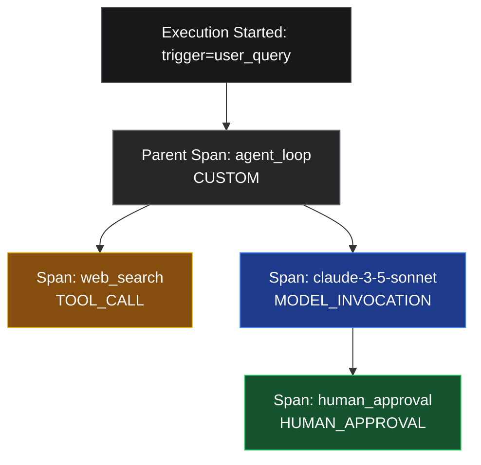

# Executions

An **execution** is one end-to-end agent run. It contains **spans** (units of work) and **events** (timeline entries).

## Lifecycle

1. `POST /api/v1/executions` - start with `agent_id`, optional `trigger` and `metadata`
2. `POST /api/v1/executions/{id}/spans` - ingest spans (auto-emits `SPAN_STARTED` / `SPAN_ENDED`)
3. `POST /api/v1/executions/{id}/events` - custom mid-span events
4. `PUT /api/v1/executions/{id}/end` - set final status

## Span DAG

Spans link via `parent_span_id` and `caused_by_span_ids` forming a directed acyclic graph rendered in the dashboard with React Flow.



Query: `GET /api/v1/executions/{id}/dag`

## Replay

`GET /api/v1/executions/{id}/replay?from_sequence=&to_sequence=` returns ordered frames for frame-by-frame debugging.

## SDK context managers

The Python SDK wraps the lifecycle:

```python
with client.telemetry.execution(agent_id="bot") as ex:
    with ex.span("model.call", span_type="MODEL_INVOCATION") as span:
        span.complete(output={"tokens": 120})
```

See [Telemetry client](/sdk/python/telemetry).
