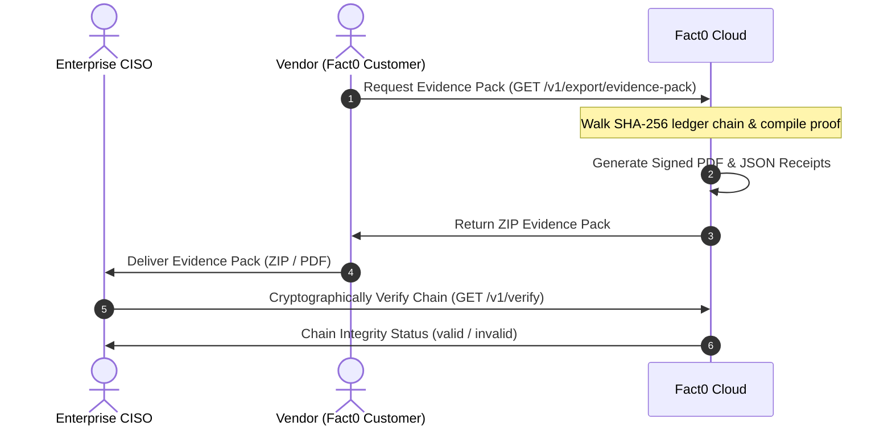
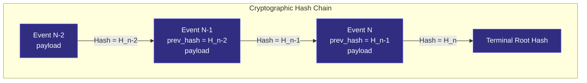

# Security reviews & compliance

This page is for **founders, compliance leads, GRC managers, and enterprise security reviewers**. 

When selling autonomous AI agents to enterprise buyers, standard SOC 2 automation platforms (like Vanta or Drata) do not answer the runtime safety questions that CISOs ask. Fact0 is built specifically to bridge this gap, providing runtime proof of agent safety boundaries.

## Key Security Review Questions Answered

Fact0 allows you to satisfy the most common AI agent security requirements:

### 1. Tool Permission Boundaries
* **The Question:** *"How do you guarantee the agent doesn't execute arbitrary writes or unauthorized system commands?"*
* **The Proof:** Every tool call is logged as a separate audit event including the actor identity, input parameters, and resource targets, proving tool execution boundaries are strictly enforced.

### 2. Data Leakage & Exfiltration
* **The Question:** *"What customer data is being sent to third-party models or external APIs?"*
* **The Proof:** All egress actions and API payloads are logged in the immutable chain, creating a clean record of all data boundary flows.

### 3. Unsupervised Action Limits
* **The Question:** *"What happens if the agent enters an infinite loop or performs unsafe actions unsupervised?"*
* **The Proof:** Traces include execution budgets and loop limits. If an agent behaves unexpectedly, you can point to the visual execution DAG to show the exact point where it was terminated.

### 4. Human-in-the-Loop Policies
* **The Question:** *"Can the agent bypass human approval for sensitive actions (e.g. initiating payments, deleting documents)?"*
* **The Proof:** Fact0 cryptographically registers human approvals alongside agent actions, proving that a manual gate was validated before execution.

---

## Evidence Export

To share this proof with a prospect's security team:

| Export | Endpoint | Description |
|--------|----------|-------------|
| Security PDF Pack | `GET /v1/export/pdf` | PDF report containing tool boundary logs and human-in-the-loop validation |
| Full Evidence Pack | `GET /v1/export/evidence-pack` | ZIP containing the PDF and verified JSON metadata |

Exports are themselves recorded as `audit.export` events for compliance.

---

## Chain Verification & Cryptographic Ledger Proof

Any security auditor can verify that the audit log has not been tampered with or modified. Fact0 uses a cryptographic chaining mechanism similar to a blockchain's ledger to guarantee immutability.

### Hashing Algorithm
For each event $E_n$ in the ledger, the cryptographic signature is calculated as follows:

$$H_n = \text{SHA256}(E_n.\text{payload} \parallel H_{n-1})$$

Where:
- $E_n.\text{payload}$ consists of the canonical JSON representation of the `actor`, `action`, `resource`, `outcome`, `metadata`, and client-provided `timestamp` fields.
- $H_{n-1}$ is the signature of the immediately preceding event in the sequence (`prev_hash`).
- $\parallel$ represents string concatenation.

Because each event's hash relies directly on the preceding event's hash, changing even a single character in a historic event will cascade down the chain, invalidating the final root hash.

### Verification Flow
Calling `GET /v1/verify?from=&to=` walks the SHA-256 chain and reports:
* `valid` - chain intact
* `events_checked` - count scanned
* `root_hash` - terminal hash
* `first_broken_event_id` - if tampering is detected

You can share a time-limited read-only link with your prospect's security team so they can view and verify the chain themselves without needing a Fact0 account.

---

## Mapping to Controls & SOC 2

This index map shows how Fact0's Universal Fact Layer capabilities directly satisfy standard SOC 2 Trust Services Criteria (TSC) and common CISO safety controls:

| TSC Control Area | Fact0 Capability | Audit Proof Evidence |
| :--- | :--- | :--- |
| **CC6.1 (Logical Access Boundaries)** | Tool call permission gating | `agent.tool.call` events, matching the specific sub-agent actor, resource scope, and outcome. |
| **CC6.8 (Unauthorized / Rogue Actions)** | Runtime agent boundary auditing | Append-only logs showing all model inputs/outputs, verifying zero command injection or policy bypasses. |
| **CC7.2 (Continuous System Monitoring)** | Real-time execution DAGs | Spans linked via `parent_span_id` trace the full dataflow logic, indicating where errors occurred. |
| **CC9.2 (Operational Risk Mitigation)** | Human-in-the-loop approvals | Cryptographic human approvals (`approval.granted`) tied directly to high-risk transactions. |
| **CC6.3 (Data Transmission & Egress)** | Data leakage tracing | Log of all actor identities, destination endpoints, and raw metadata payload logs. |

