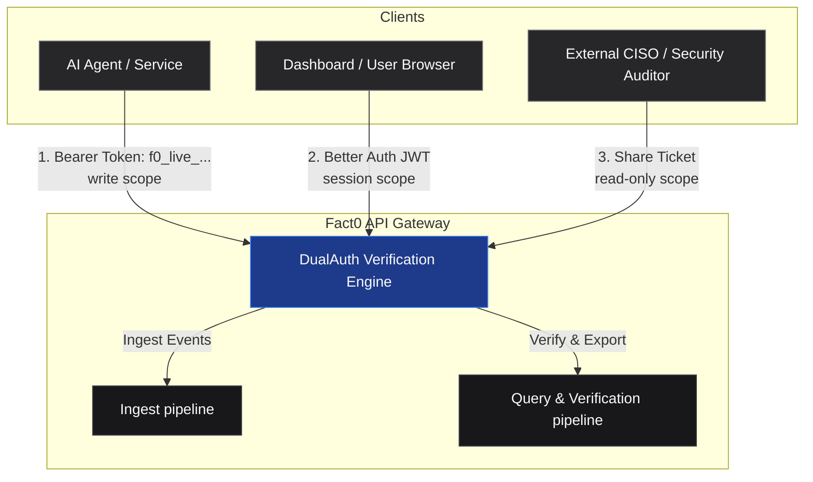

# Security

## API keys

| Prefix | Usage |
|--------|-------|
| `f0_live_*` | Production API keys |

Keys are bound to an organization tenant. Raw secrets are shown **once** at creation; only a SHA-256 hash is stored server-side.

## Scopes

| Scope | Permissions |
|-------|-------------|
| `read` | List, verify, export, stream |
| `write` | Ingest events (`POST /v1/events*`) |

Write routes reject read-only keys with `403 forbidden`.

## Authentication surfaces

| Surface | Auth mechanism |
|---------|----------------|
| Audit ingest | Bearer API key (write) |
| Audit reads | API key **or** dashboard JWT (DualAuth) |
| SSE stream | API key **or** single-use SSE ticket |
| Share links | Share bearer token |
| Dashboard `/v1/me/*` | Better Auth JWT |
| Telemetry `/api/v1/*` | Bearer API key (write for ingest; read for queries) |

## Key rotation

1. Create a new key in **Settings → API Keys**
2. Deploy the new key to your agents
3. Revoke the old key - revoked keys return `401` immediately

## Share links

Time-bounded, read-only access to a subset of audit events. Tokens are bearer credentials - do not embed in URLs.

## Data retention

Retention sweeps are plan-scoped. See dashboard **Settings → Plan** for your organization's retention window.
